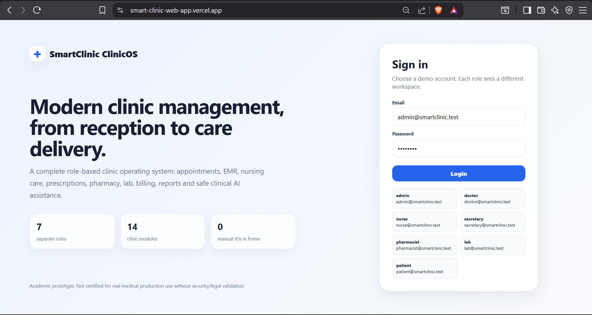
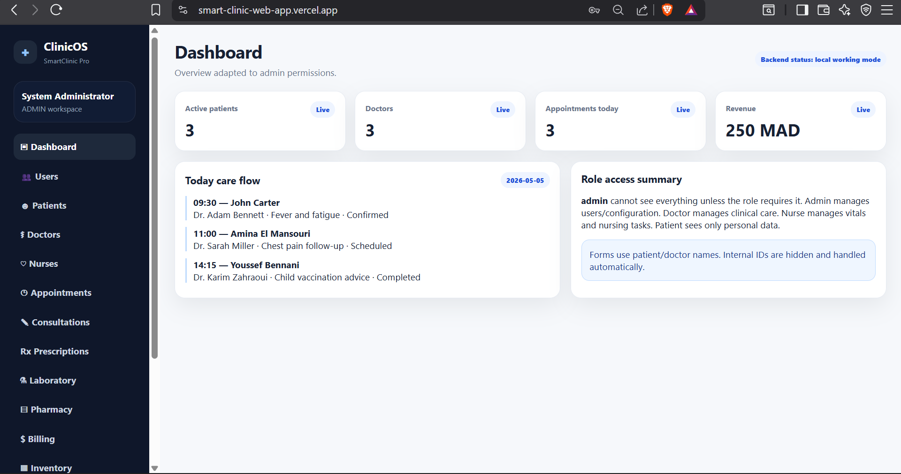
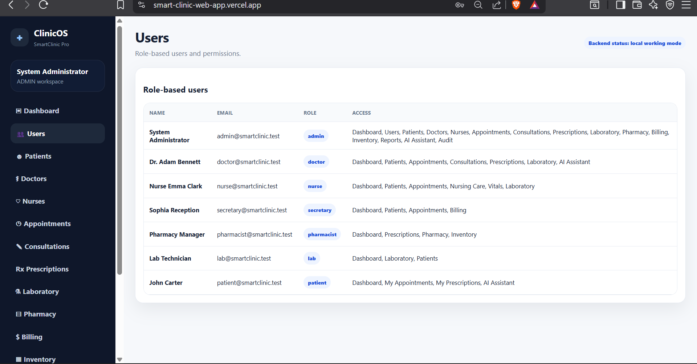
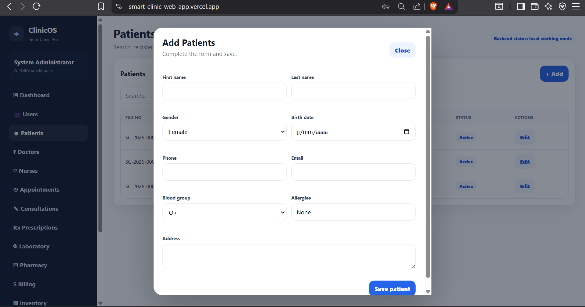
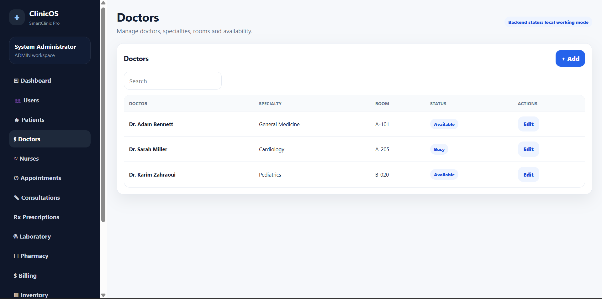
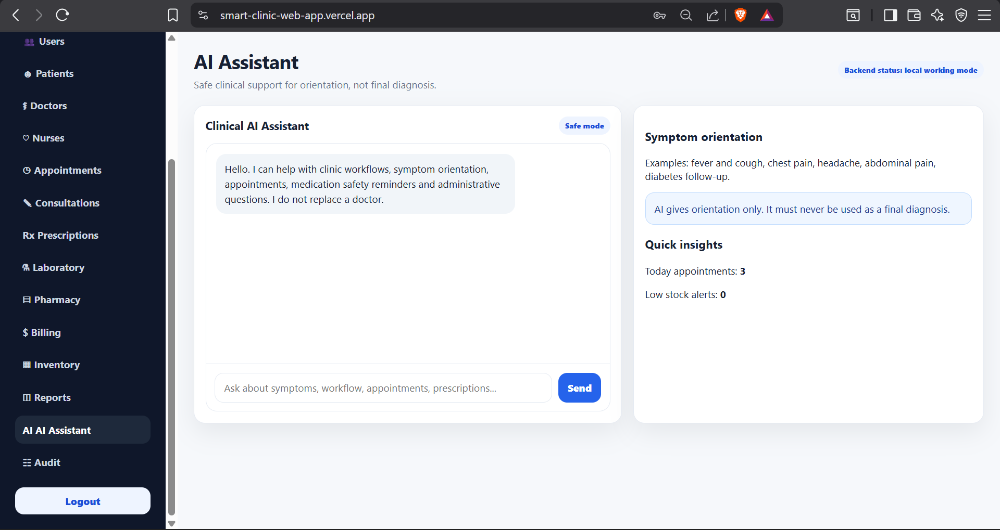
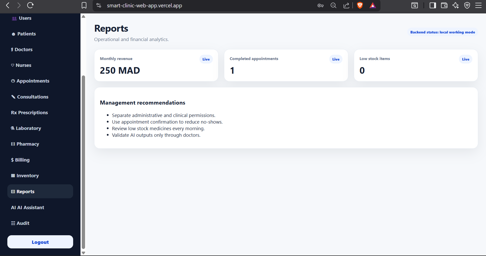

# 🧠 SmartClinic — Intelligent Medical Management System

  

---

## 🚀 Overview

SmartClinic est une application web intelligente dédiée à la gestion des cabinets médicaux.  
Elle permet de centraliser les données patients, les consultations et d’intégrer une logique d’aide médicale.

---

## 🌐 Live Application

👉 https://smart-clinic-web-app.vercel.app/

---

## ✨ Key Features

- 👨‍⚕️ Gestion des patients
- 📅 Rendez-vous & planning
- 📋 Consultations médicales
- 🧾 Ordonnances
- 📊 Dashboard & statistiques
- 🤖 Assistant IA (prototype)

---

## 📸 Preview

---

## 🧱 Architecture

- Frontend : React + Vite
- Backend : Laravel API
- IA : Python (logique médicale)
- Database : PostgreSQL

---

## 🎯 Objective

Ce projet vise à reproduire une solution complète utilisée dans les environnements médicaux modernes.

---

## 🔒 Source Code

Le code source est privé.  
Disponible sur demande pour évaluation technique.

---
